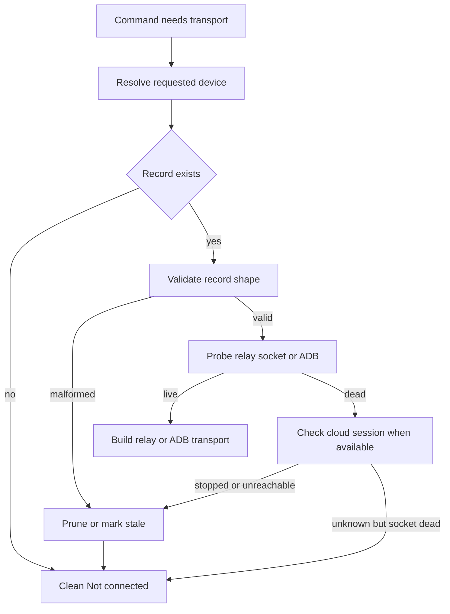
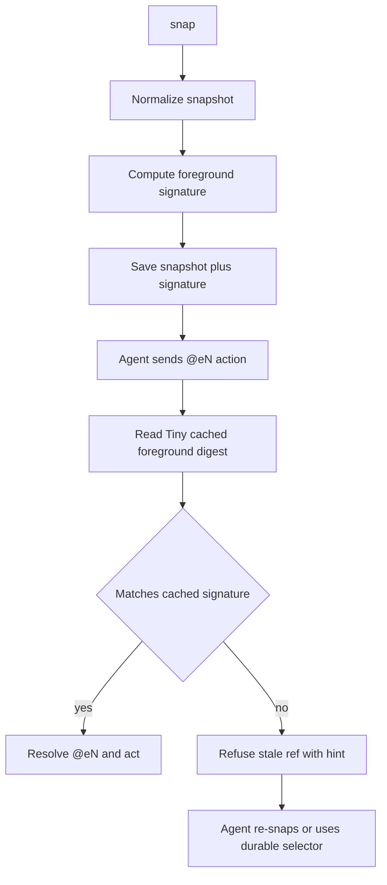
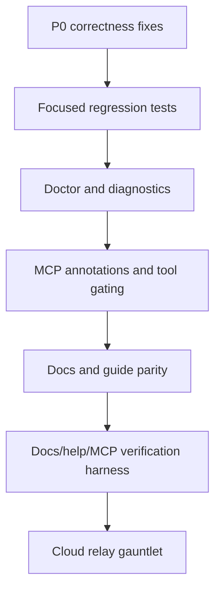

# fix: Harden Handheld agent loop and tool surface

## Summary

This plan hardens Handheld's agent control loop end to end: stale cloud connections must fail cleanly, stale snapshot refs must stop before mis-tapping, snapshot output must avoid misleading actionable nodes, and the CLI/MCP/docs surfaces must become easier for agents to verify. The cloud-gauntlet P0s lead the work; the agent-surface improvements become the harness, docs, and tool-metadata layer around those fixes.

---

## Problem Frame

Two independent cloud relay gauntlets found that prior hardening was only partial. The worst failures are agent-loop correctness issues: a dead relay socket can crash a command with an unhandled Node error, and cached `@eN` refs can survive screen changes and execute stale coordinates with exit 0. Those are higher priority than polish because they break the autonomous `snap -> act -> verify` contract.

The same evidence also identified follow-up gaps that affect agent confidence: title-less actionable rows in snapshots, unproven sent-but-unsettled warnings, dirty Tiny whitespace artifacts, relay-only file transfer gaps, stale MCP/default-tool docs, missing MCP safety metadata, and config output that promises API-key masking but can print a keyed secret path.

---

## Requirements

**Connection and session safety**

- R1. A dead, stale, or malformed connection record must never produce an uncaught exception, raw stack trace, or `TypeError` on control commands.
- R2. A command with no usable live connection must emit the standard `Not connected.` message with a reconnection hint and exit non-zero.
- R3. Explicit target resolution must be predictable: `--device`, `HANDHELD_DEVICE`, and an explicitly configured default device that resolve to no live connection must fail cleanly instead of silently retargeting another connection.
- R4. Stale session records must be prunable, and connection resolution must be able to auto-prune records whose relay socket is unreachable and whose cloud session is no longer live.
- R5. The health surface must expose a read-only diagnostic path that reports config, active connection, relay, ADB, Tiny, and stale-prune readiness without leaking secrets.

**Snapshot ref correctness**

- R6. Cached `@eN` refs must be stamped with a foreground signature and refused when the live foreground no longer matches the snapshot that produced the ref.
- R7. Stale-ref refusal must cover `open-app`, `launch`, off-CLI screen changes, `press-key back`, and `--no-settle` navigation, not only named navigation commands.
- R8. Durable selectors such as `id=`, `label=`, and `text=` must continue resolving against the relevant live or cached snapshot semantics and remain the recommended agent path.

**Snapshot and input robustness**

- R9. Default snapshots must not render actionable rows with real bounds but no title when their title-bearing children were culled.
- R10. Snapshot display filtering must reject zero-area actionable nodes in both height and width, including noisy `--all` cases where appropriate.
- R11. Tiny set-text behavior must preserve leading, trailing, and internal whitespace, with source and APK artifacts kept in sync and verified from a clean baseline.
- R12. Server-settle reporting must distinguish a confirmed device inject from an aborted send before inject; only confirmed-inject settle failures may report `settleInconclusive`.
- R13. Relay snapshot parsing must not leave stale caches after parse failures or partial/empty snapshot reads.

**Relay operations**

- R14. Relay-only cloud connections must either support `push` and `pull` through the gateway file route or continue failing with clean, non-crashing, explicit unsupported-mode messages until the route exists.
- R15. Local ADB file-transfer behavior must remain the fast path when a local or tunneled ADB transport is available.

**Agent-facing CLI, MCP, and docs**

- R16. `handheld config get api-key` and all config summary paths must mask stored API keys by default.
- R17. MCP list-tools output must include safety annotations or equivalent metadata for read-only, mutating, destructive, idempotent, and open-world operations where the SDK supports them.
- R18. Default MCP tools must match documented defaults, including `teach_request`, and compatibility/operator tools must be clearly gated.
- R19. CLI docs and in-binary guides must use hyphenated CLI command names for shell examples and reserve underscore names for MCP tool names or compatibility aliases.
- R20. Agents must get a compact snapshot projection suitable for context-limited loops without changing existing `snap --json` behavior.
- R21. A repeatable verification harness must check CLI help/docs drift, MCP tool-list drift, secret masking, stale-connection behavior, stale-ref behavior, snapshot filtering, Tiny whitespace, and live cloud/local gauntlet scenarios.

---

## Scope Boundaries

**In scope**

- CLI control-loop behavior, connection resolution, stale session pruning, and health diagnostics.
- Snapshot cache metadata, ref resolution, snapshot formatting/filtering, and compact agent projection.
- Tiny helper source/APK synchronization for the whitespace fix.
- Server-settle client/device acknowledgement semantics and deterministic warning-branch proof.
- MCP list-tools shape, annotations, tool grouping, and documentation parity.
- README, install guide, in-binary guide text, gauntlet methodology docs, and automated docs/help validators.

**Deferred to follow-up work**

- Final foreground-signature stale-ref refusal is temporarily sequenced later. The chosen design is a Tiny cached foreground/digest endpoint first, not a slow snapshot round-trip guard, and implementation should do the other units before this endpoint/ref-guard tranche.
- Full `handheld run` local-device parity. This plan should clarify current cloud/API requirements, but implementing local-run parity is deferred unless implementation discovers it is required for P0 validation.
- Large MCP API redesign beyond annotations, categorization, and safer gating.
- Removing existing underscore CLI aliases. The plan may document them as compatibility aliases, but removal needs an explicit compatibility decision.
- New release/version bump. Versioning is release-owned and outside this implementation plan.

**Out of scope**

- Product repositioning, naming, or landing-page work.
- Changing Gateway file-route APIs beyond what is necessary to consume an existing or planned relay file mechanism.
- Rewriting the CLI around a new framework or changing package manager/runtime.

---

## Key Technical Decisions

- KTD1. Treat the attached cloud-gauntlet packet as the source of truth, with one sequencing exception: connection crash-proofing/prune stays first, while final stale-ref correctness waits for the Tiny cached foreground/digest endpoint and ships after the other non-blocked units.
- KTD2. Resolve stale connection records through liveness and pruning, not exception handling alone. Catching socket errors prevents crashes; liveness validation and prune semantics prevent repeatedly selecting dead state.
- KTD3. Fail explicit stale targets rather than silently retargeting. Agents need deterministic device identity more than opportunistic fallback when a configured default or explicit target is stale.
- KTD4. Replace command-name cache clearing with foreground-signature validation backed by a Tiny cached foreground/digest endpoint. Package/activity alone is not sufficient; the signature must include `layoutDigest` and an event or window sequence signal when available.
- KTD5. Add new projection modes instead of changing existing output contracts. Existing `snap --json`, text snapshots, aliases, and MCP tool names are compatibility surfaces.
- KTD6. Keep ADB and relay lanes separate but converge their user-facing semantics. Relay-only cloud should not pretend to have ADB, but errors, docs, and health checks should explain the active route cleanly.
- KTD7. Put agent-surface checks in automation, not only docs. In-binary guide text, README examples, MCP lists, and command registration should be validated so drift is caught before another gauntlet.

---

## High-Level Technical Design

### Connection Resolution and Pruning

The resolver should separate target selection from transport construction. Selection decides which device was requested. Liveness decides whether the selected record can be used. Transport construction should not be the first place a dead socket is discovered.

### Snapshot Ref Guard

Foreground signature should be cheap and stable enough for ref safety. The chosen design is a Tiny endpoint that returns cached package, activity, `layoutDigest`, and event/window sequence data without rebuilding the full tree on every ref action. If the signature cannot be read, the safe fallback for `@eN` is refusal, while durable selectors may keep their documented behavior only when they are resolved against a fresh snapshot.

### Agent Surface Delivery

The polish work should not outrun correctness. Diagnostics, metadata, and docs become useful only after the control loop is safe enough to describe precisely.

---

## Phased Delivery

- Phase A: land U1 and U2 first. This closes secret leakage, stale/dead connection crashes, explicit-default retargeting, stale pruning, and doctor/status diagnostics.
- Phase B: land U4, U5, U6, U7, U8, U9, U10, and the non-U3 portions of U11. This handles snapshot display truthfulness, Tiny whitespace/version delivery, settle ack semantics, relay transfer/parse hardening, MCP/docs parity, and compact projection.
- Phase C: land U3 after the Tiny cached foreground/digest endpoint is designed and implemented. Then finish U11 stale-ref harness coverage and run the final cloud relay gauntlet.

---

## Implementation Units

### U1. Secret-safe config output

- **Goal:** Ensure config reads never print full API keys by default.
- **Requirements:** R16.
- **Dependencies:** None.
- **Files:**
  - `src/commands/auth.ts`
  - `src/commands/auth.test.ts`
  - `README.md`
  - `install.md`
- **Approach:** Route keyed `config get api-key` through the same masking helper used by full config output. If an explicit reveal path is added, make it opt-in, visibly named, and covered by tests; otherwise keep all CLI config reads masked.
- **Patterns to follow:** Existing config command registration in `src/commands/auth.ts`; existing env/config precedence tests in `src/commands/auth.test.ts`.
- **Test scenarios:**
  - Saved `api-key` exists and `config get api-key` prints a masked value, not the full key.
  - Saved `api-key` exists and `config get` prints all values with the key masked.
  - Missing keyed config still prints the existing `Not set` message and hint.
  - Non-secret keys such as `api-url` and `default-device` remain unmasked.
- **Verification:** Config output is secret-safe in unit coverage and manual smoke output; docs no longer imply behavior the keyed path violates.

### U2. Connection liveness, stale pruning, and doctor

- **Goal:** Make stale/dead/malformed connection records fail cleanly and expose a diagnostic/prune path.
- **Requirements:** R1, R2, R3, R4, R5.
- **Dependencies:** U1 for safe diagnostic output.
- **Files:**
  - `src/state.ts`
  - `src/commands/control.ts`
  - `src/commands/status.ts`
  - `src/commands/connect.ts`
  - `src/commands/disconnect.ts`
  - `src/transport/relay/daemon.ts`
  - `src/commands/control.test.ts`
  - `src/commands/connect-state.test.ts`
  - `src/commands/disconnect.test.ts`
  - `src/state.test.ts`
  - `src/commands/status.test.ts`
  - `src/commands/doctor.test.ts`
  - `src/cli.ts`
  - `README.md`
  - `install.md`
- **Approach:** Introduce a resolver path that validates requested device identity, record shape, relay socket reachability, and ADB availability before constructing command transports. Wrap relay daemon socket errors and normalize `ENOENT`, `ECONNREFUSED`, missing `adb`, and missing `socketPath` into the standard clean disconnected surface. Add `status --prune` and `doctor` on top of the same liveness helper so diagnostics and command execution agree.
- **Execution note:** Start with characterization tests for stale socket and malformed-record failure surfaces before refactoring resolver internals.
- **Patterns to follow:** `getConfig`, `getConnections`, `getActiveConnection`, and `removeConnection` in `src/state.ts`; existing clean disconnected messaging in `src/commands/control.ts`; disconnect target resolution tests in `src/commands/disconnect.test.ts`.
- **Test scenarios:**
  - No connection records produce clean `Not connected.` with hint and no stack trace.
  - Configured default device points to a record whose socket path does not exist; bare command fails cleanly and does not fall back to another live record.
  - `HANDHELD_DEVICE` points to a stale record; command fails cleanly with the requested identity preserved in diagnostics.
  - `--device` points to a stale record; command fails cleanly and does not use the default.
  - Connection record missing `adb` or `adb.serial` does not throw while resolving transport.
  - `status --prune` removes unreachable relay records and leaves live records intact.
  - `doctor --json` reports config, target, relay, ADB, Tiny, and stale-prune state without printing a full API key.
  - Local `connect --local` records continue to resolve through ADB without requiring Gateway API credentials.
- **Verification:** Stale cloud records from the gauntlet reproduce as clean disconnected results; status/doctor and command execution share one liveness interpretation.

### U3. Foreground-signature stale-ref guard

- **Goal:** Add a Tiny cached foreground/digest endpoint, then refuse cached `@eN` actions when the screen has changed since the snapshot that created the ref.
- **Requirements:** R6, R7, R8.
- **Dependencies:** U2 for stable target/transport resolution; U5 for Tiny source/APK propagation and version checks.
- **Files:**
  - `android/tiny-snapshot-helper-v2/src/main/java/com/example/tinysnapshot/v2/SnapshotService.java`
  - `android/tiny-snapshot-helper-v2/README.md`
  - `assets/tiny-snapshot-helper.apk`
  - `src/tiny-helper.ts`
  - `src/snapshot.ts`
  - `src/device-actions.ts`
  - `src/commands/control.ts`
  - `src/action-wait.ts`
  - `src/server-settle.ts`
  - `src/snapshot.test.ts`
  - `src/device-actions.test.ts`
  - `src/commands/control.test.ts`
  - `src/action-wait.test.ts`
  - `src/server-settle.test.ts`
  - `src/tiny-helper.test.ts`
  - `src/commands/guide.ts`
- **Approach:** Do not implement an interim snapshot-round-trip guard unless explicitly re-scoped. First add a Tiny endpoint that can return cached foreground/digest state without rebuilding the full accessibility tree for every `@eN` action. Persist package, activity, `layoutDigest`, and event/window sequence data with saved snapshots. At `@eN` resolution time, compare the cached signature with the Tiny endpoint response before using cached coordinates. Refuse stale refs with a direct hint to re-snap or use a durable selector. Replace or demote per-command cache-clearing as an optimization, not the safety mechanism.
- **Execution note:** Implemented in the U3 tranche: Tiny now exposes a foreground/digest signature endpoint, cached snapshots persist comparable signatures, and CLI/MCP cached target resolution refuses stale refs/selectors before dispatch.
- **Patterns to follow:** Existing `saveLastSnapshot` and `loadLastSnapshot` cache flow in `src/snapshot.ts`; existing post-action cache refresh in `src/action-wait.ts` and `src/server-settle.ts`; selector resolution split in `src/device-actions.ts`.
- **Test scenarios:**
  - Tiny foreground/digest endpoint returns package, activity, `layoutDigest`, and event/window sequence data without a full snapshot-class read on the action path.
  - Same-activity content change with a different `layoutDigest` is treated as stale even when package/activity are unchanged.
  - Cached launcher ref followed by `open-app settings` then `tap @eN` refuses with a screen-changed hint.
  - Cached Settings ref followed by off-CLI `shell am start` then `tap @eN` refuses with the same hint.
  - Cached subpage ref followed by `press-key back` then `tap @eN` refuses.
  - `--no-settle` navigation followed by the old ref refuses.
  - Settled `tap -> tap` flow that refreshes the cache continues to work when the foreground signature matches.
  - `id=` and `label=` selectors still resolve according to their documented semantics and do not inherit unsafe stale-coordinate behavior.
  - Missing or unreadable live foreground signal fails closed for `@eN` rather than executing stale coordinates.
- **Verification:** All gauntlet stale-ref vectors exit non-zero before input dispatch; durable selector workflows remain available for agents.

### U4. Snapshot display robustness for title-less and zero-area nodes

- **Goal:** Prevent misleading default snapshot rows that look actionable but have no visible title.
- **Requirements:** R9, R10.
- **Dependencies:** None; keep independent of deferred U3 endpoint work unless implementation shares snapshot metadata structures.
- **Files:**
  - `src/snapshot.ts`
  - `src/snapshot.test.ts`
  - `README.md`
  - `src/commands/guide.ts`
- **Approach:** Strengthen display-node selection so a partially visible actionable parent whose title/subtitle children were culled either hoists the title from those children or is itself culled when the title cannot be represented truthfully. Add width-based zero-area filtering alongside the existing height guard. Keep `--all` useful for debugging without allowing zero-width noise to masquerade as actionable default guidance.
- **Patterns to follow:** Existing title/subtitle hoisting tests and M2 phantom tests in `src/snapshot.test.ts`; snapshot formatting and display-node filtering in `src/snapshot.ts`.
- **Test scenarios:**
  - Settings-style row with parent button bounds at viewport edge and title child just below cull boundary does not render title-less in the default view.
  - Same row hoists `Battery` when the title-bearing child is available enough to name the row truthfully.
  - Parent row with unavailable title and center outside the visible scrollable viewport is culled from the default view.
  - Zero-width actionable controls are filtered from default display and handled consistently in `--all`.
  - Existing titled rows, editable fields, keyboard keys, and standalone headings keep their current formatting.
- **Verification:** Repeated fold-straddle Settings snapshots show no title-less actionable default rows; tapping the bottom-most rendered row matches its displayed title.

### U5. Tiny whitespace fix verification and artifact sync

- **Goal:** Turn the dirty in-progress Tiny whitespace fix into a clean, committed, verified source/APK change.
- **Requirements:** R11.
- **Dependencies:** U2 for stable cloud/local diagnostic confidence; otherwise independent.
- **Files:**
  - `android/tiny-snapshot-helper-v2/src/main/java/com/example/tinysnapshot/v2/SetTextService.java`
  - `src/tiny-helper.ts`
  - `src/commands/control.ts`
  - `android/tiny-snapshot-helper-v2/README.md`
  - `assets/tiny-snapshot-helper.apk`
  - `src/tiny-helper.test.ts`
  - `src/text-entry.test.ts`
  - `src/tiny-input.test.ts`
- **Approach:** Preserve the existing dirty Tiny source/APK work only after proving it against a clean baseline. The source and bundled APK must land together. Add a Tiny bundled-build or helper-version check to the connect/ensure path so an already-running but older compatible Tiny is reinstalled rather than silently reused. The acceptance proof should show leading, trailing, and internal whitespace preserved through relay Tiny `setText`, not merely local source tests.
- **Execution note:** Characterize the clean-baseline trim behavior before trusting the current dirty APK result.
- **Patterns to follow:** Existing Tiny build script and Tiny helper tests; current `typeViaTinySetText` paths in `src/text-entry.ts`.
- **Test scenarios:**
  - Clean baseline demonstrates the previous trim behavior, or the plan records why the baseline cannot be reproduced.
  - Updated Tiny source preserves leading spaces, trailing spaces, and internal multiple spaces.
  - Bundled APK corresponds to the updated source and is installed by the CLI path used in cloud relay sessions.
  - Already-running Tiny with an older bundled build/version is detected and reinstalled or force-upgraded on the relevant ensure path.
  - Existing Tiny target-resolution behavior still works for stableId and focused-field paths.
- **Verification:** Source and APK are synchronized, unit tests pass, and a relay cloud device preserves whitespace in a live field.

### U6. Inject-ack settle semantics and deterministic warning proof

- **Goal:** Distinguish `sent but unsettled` from `never reached device` and make the warning branch reproducible.
- **Requirements:** R12.
- **Dependencies:** U5 if the deterministic test surface is implemented in Tiny; U2 for reliable relay transport diagnostics.
- **Files:**
  - `src/server-settle.ts`
  - `src/action-wait.ts`
  - `src/tiny-helper.ts`
  - `src/server-settle.test.ts`
  - `src/action-wait.test.ts`
  - `src/tiny-helper.test.ts`
  - `android/tiny-snapshot-helper-v2/src/main/java/com/example/tinysnapshot/v2/SetTextService.java`
  - `android/tiny-snapshot-helper-v2/README.md`
- **Approach:** Use existing primitives before inventing a new protocol. The device input path already reports inject acknowledgement data; the issue is that a timeout can hide the response. Prefer splitting the client flow into input/inject acknowledgement followed by the existing stable-wait endpoint, unless implementation proves early chunk flushing is cleaner. Client-side settle logic should report `settleInconclusive` only when inject is confirmed and the settle phase times out or aborts. A pre-inject abort should be treated as not sent or eligible for the existing safe fallback path, with no double-fire.
- **Technical design:** Directional state model only:
  - `not_dispatched`: request failed before device acknowledgement.
  - `injected`: device accepted/fired input.
  - `settled`: layout became stable after inject.
  - `injected_unsettled`: inject confirmed, settle did not complete in time.
- **Patterns to follow:** Existing `failedBeforeReachingDevice` and `tryServerSettle` split in `src/server-settle.ts`; settle snapshot caching in `src/action-wait.ts`.
- **Test scenarios:**
  - Abort before inject acknowledgement does not report `settleInconclusive`.
  - Timeout after inject acknowledgement reports `settleInconclusive` and exits through the intended warning path.
  - Confirmed inject followed by settle failure does not trigger a second input dispatch.
  - Existing happy-path settle still caches the settled snapshot.
  - Deterministic device or Tiny test surface can reproduce the warning branch during live gauntlet.
- **Verification:** The warning branch is proven at least once on a real device or deterministic Tiny-backed surface, and pre-inject aborts are no longer misreported as sent.

### U7. Relay file transfer and snapshot transport robustness

- **Goal:** Support or safely gate relay-only file transfer, and prevent relay snapshot parse failures from feeding stale caches.
- **Requirements:** R13, R14, R15.
- **Dependencies:** U2 for reliable transport-mode detection.
- **Files:**
  - `src/commands/control.ts`
  - `src/api-client.ts`
  - `src/transport/relay/client.ts`
  - `src/transport/relay/daemon.ts`
  - `src/transport/router.ts`
  - `src/commands/control.test.ts`
  - `src/api-client.test.ts`
  - `src/transport/relay/client.test.ts`
  - `src/transport/router.test.ts`
  - `README.md`
  - `install.md`
- **Approach:** Register `push` as a real command. Treat `push` and `pull` as asymmetric work: relay `push` can build on the existing gateway upload/session-file primitive, while relay `pull` needs a download counterpart or a clean unsupported-mode message until one exists. For snapshots, focus on transport read framing and Tiny JSON parse/retry behavior; parse or partial-read failures must retry or clear/refuse cache rather than leaving stale data in place.
- **Patterns to follow:** Existing install/upload session paths in `src/commands/control.ts`; API client file/session methods if already present; router command tests for transport selection.
- **Test scenarios:**
  - `push` command is registered and has command-specific help.
  - Local ADB `pull` keeps existing behavior.
  - Relay-only `pull` uses gateway file route when available or produces a clean unsupported hint when not.
  - Relay-only `push` uses gateway file route when available or produces a clean unsupported hint when not.
  - Snapshot JSON parse failure retries within a bounded policy and does not preserve a stale `@eN` cache.
  - Empty or partial snapshot is identified and either retried or marked unsafe for action resolution.
- **Verification:** Relay-only cloud file commands no longer appear as unregistered or ADB-confused; snapshot parse failures cannot silently feed stale-cache action paths.

### U8. MCP annotations, categories, and default-tool parity

- **Goal:** Make MCP list-tools safer and easier for agents/hosts to reason about.
- **Requirements:** R17, R18.
- **Dependencies:** U2 for corrected connection semantics. U3-specific stale-ref semantics can be documented after the deferred endpoint lands.
- **Files:**
  - `src/mcp/server.ts`
  - `src/mcp/server.test.ts`
  - `README.md`
  - `install.md`
- **Approach:** Add tool annotations or equivalent metadata supported by `@modelcontextprotocol/sdk` for read-only, mutating, destructive, idempotent, and open-world operations. Split tools into core, operator, and compatibility categories in data rather than prose. Keep `HANDHELD_MCP_FULL=1` as a compatibility route while allowing narrower exposure for operator and compatibility tools if useful. Update documented default tools to match `CORE_MCP_TOOL_NAMES`, including `teach_request`.
- **Patterns to follow:** Existing `TOOLS`, `CORE_MCP_TOOL_NAMES`, `listVisibleTools`, and `ListToolsRequestSchema` flow in `src/mcp/server.ts`.
- **Test scenarios:**
  - Default MCP list includes exactly the intended core tools and includes `teach_request`.
  - Full mode includes operator and compatibility tools without changing default mode.
  - Read-only tools carry read-only hints.
  - Destructive or mutating tools do not carry read-only hints and are categorized correctly.
  - Documentation default list matches the code-derived default list.
  - Hidden/compatibility CLI affordances are not accidentally promoted into default MCP tools.
- **Verification:** MCP hosts can inspect the tool list and distinguish safe reads from operations that mutate devices, sessions, files, profiles, billing, or apps.

### U9. CLI docs, guide parity, and run semantics

- **Goal:** Align human docs, in-binary help, and command naming around the actual CLI/MCP surface.
- **Requirements:** R18, R19.
- **Dependencies:** U8 for final MCP default list; U2 for doctor/status language.
- **Files:**
  - `README.md`
  - `install.md`
  - `src/commands/guide.ts`
  - `src/commands/control.ts`
  - `src/commands/run.ts`
  - `src/commands/run.test.ts`
  - `src/cli.ts`
- **Approach:** Use hyphenated command names in shell examples, keep underscore names in MCP docs and compatibility notes, and clearly label hidden/compat commands separately from canonical agent workflow commands. Clarify whether `handheld run` is cloud/API-only today; do not implement local-run parity in this unit unless the implementation team explicitly expands scope.
- **Patterns to follow:** Existing command aliases in `src/commands/control.ts`; guide topics in `src/commands/guide.ts`; current `run` tests in `src/commands/run.test.ts`.
- **Test scenarios:**
  - Guide workflow examples use `long-press`, `double-tap`, `press-key`, `list-apps`, and `open-app` for CLI shell commands.
  - README/install shell examples use hyphenated CLI names except where explicitly documenting compatibility aliases.
  - MCP docs use underscore tool names and do not imply those are preferred shell command names.
  - `run` docs match actual credential and default-device requirements.
  - Root help names `doctor` once U2 lands.
- **Verification:** A new agent reading `guide workflow`, README, or install docs sees one canonical CLI path and a distinct MCP naming path.

### U10. Compact agent snapshot projection

- **Goal:** Add a context-efficient snapshot format for agent loops without breaking existing JSON/text output.
- **Requirements:** R20.
- **Dependencies:** U4 for truthful display filtering. U3 signature fields are included only after the deferred Tiny foreground/digest endpoint lands.
- **Files:**
  - `src/snapshot.ts`
  - `src/commands/control.ts`
  - `src/mcp/server.ts`
  - `src/snapshot.test.ts`
  - `src/commands/control.test.ts`
  - `src/mcp/server.test.ts`
  - `README.md`
  - `src/commands/guide.ts`
- **Approach:** Add a new projection such as `snap --agent` or an equivalent compact option that returns only action-relevant fields: ref, stable id, role, label/text/value, resource id, actions, focus/checked/disabled state, and minimal bounds when needed. Add foreground signature summary only after U3 lands. Keep `snap --json` and `snap --raw` stable.
- **Patterns to follow:** Existing `snapshotForOutput`, `snapshotNodesForDisplay`, and `formatSnapshot` paths in `src/snapshot.ts`; MCP `snap` schema in `src/mcp/server.ts`.
- **Test scenarios:**
  - Compact projection includes durable selectors and action metadata for actionable nodes.
  - Compact projection omits raw tree noise and large fields not needed for the agent loop.
  - Existing `snap --json` output remains unchanged for compatibility.
  - Existing text snapshot formatting remains unchanged except where U4 intentionally removes misleading nodes.
  - MCP `snap` can request or return compact projection without changing default behavior unexpectedly.
- **Verification:** Agent-facing snapshots become smaller and safer while current consumers of `--json` and text output keep their contracts.

### U11. Verification harness and gauntlet methodology

- **Goal:** Make the plan's regressions mechanically checkable before and after live cloud validation.
- **Requirements:** R21.
- **Dependencies:** U1 through U10, with stale-ref guard coverage completed after deferred U3 lands.
- **Files:**
  - `src/cli-help.test.ts`
  - `src/docs-command-examples.test.ts`
  - `src/mcp/server.test.ts`
  - `src/commands/control.test.ts`
  - `src/snapshot.test.ts`
  - `src/server-settle.test.ts`
  - `src/tiny-helper.test.ts`
  - `package.json`
  - `docs/handheld-next-round-improvements-2026-06-02.md`
  - `docs/handheld-fix-verification-cloud-2026-06-02.md`
  - `docs/handheld-agent-loop-gauntlet.md`
  - `README.md`
  - `install.md`
- **Approach:** Add automated checks for command registration/help, docs examples, MCP default list, MCP annotations, secret masking, stale connection records, stale-ref refusal, snapshot display filtering, Tiny whitespace, and settle state classification. Preserve a live gauntlet doc that requires isolated state, clean Tiny baseline, target constraints, deterministic H3 surface, and exit-code capture without pipe artifacts.
- **Patterns to follow:** Existing Vitest layout and package scripts; current gauntlet docs under `docs/`.
- **Test scenarios:**
  - Every documented `handheld <command>` example maps to a registered command or is explicitly excluded as a narrative example.
  - Every default MCP tool documented in README matches the code-derived default list.
  - Secret-like test values do not appear in CLI config output snapshots.
  - Stale socket, malformed record, and stale default-device fixtures fail cleanly.
  - Stale-ref guard fixtures cover all corroborated H2 vectors.
  - Snapshot fixtures cover title-less row, zero-height, zero-width, keyboard, and normal titled rows.
  - Tiny whitespace fixture covers leading, trailing, and internal spaces.
  - Settle fixtures cover pre-inject abort, post-inject settle timeout, and happy path.
- **Verification:** The full automated suite plus one live cloud relay gauntlet demonstrate the control loop is safe before the plan is marked complete.

---

## Acceptance Examples

- AE1. Given a saved connection record whose relay socket path no longer exists, when an agent runs a control command with that device as the default, then the command exits non-zero with `Not connected.`, includes a reconnection hint, and prints no raw stack trace.
- AE2. Given two records where the configured default is stale and another record is live, when the agent runs a bare control command, then the CLI fails on the stale explicit default instead of retargeting the live device.
- AE3. Given a cached launcher snapshot and then an `open-app settings` screen change, when the agent taps the old `@eN`, then the CLI refuses the stale ref before dispatching input and tells the agent to re-snap or use a durable selector.
- AE4. Given a Settings row whose visible parent is actionable but title-bearing children are below the cull boundary, when the snapshot is formatted in default mode, then the row is either titled truthfully or omitted.
- AE5. Given a Tiny `setText` request with leading and trailing spaces over relay, when the text is entered into a field, then the field value preserves those spaces in the next snapshot.
- AE6. Given device input is acknowledged but the settle phase times out, when the action completes, then the CLI reports settle inconclusive without double-firing; if inject was never acknowledged, it does not report the action as sent.
- AE7. Given a relay-only cloud connection, when an agent asks for file push or pull, then the command either succeeds through the gateway route or fails with a clean unsupported-mode hint, never as an unregistered command or ADB-only confusion.

---

## System-Wide Impact

- **Agent correctness:** The largest behavior change is fail-closed `@eN` handling, but that change is intentionally deferred until the Tiny cached foreground/digest endpoint lands. Before U3, the plan still improves connection safety, snapshot truthfulness, Tiny delivery, settle reporting, relay operations, MCP metadata, docs, and harness coverage.
- **CLI compatibility:** Existing aliases and output modes should remain available. New safer behavior affects stale refs and stale connections, which are failure paths rather than intended successful workflows.
- **MCP host safety:** Tool annotations and grouping improve host-side planning and permission decisions without requiring a new MCP server.
- **Cloud/local transport boundaries:** Relay-only cloud and local ADB paths become more explicit. This reduces ambiguity but may surface unsupported relay file behavior more visibly until gateway file routing lands.
- **Tiny artifact handling:** Source/APK sync becomes load-bearing for correctness; dirty APK-only validation is not acceptable proof.

---

## Risks & Dependencies

- **Foreground signature false positives:** If the signature includes a volatile field, valid follow-up refs may be refused. Mitigate by using cached package/activity, filter-independent `layoutDigest`, event/window sequence data, and live gauntlet coverage.
- **Foreground signature false negatives:** If the signature omits `layoutDigest` or sequence data, same-activity changes may still pass. Mitigate by making those fields part of U3's required endpoint contract and covering the gauntlet's `open-app`, off-CLI, `press-key back`, and `--no-settle` vectors.
- **Prune aggressiveness:** Auto-prune could remove records that are temporarily unreachable. Mitigate by separating socket-dead, session-stopped, and unknown states, and making manual `status --prune` behavior explicit.
- **Tiny rebuild drift:** APK/source mismatch would invalidate M1 proof. Mitigate by requiring source and APK in the same change and testing the packaged artifact.
- **H3 device support:** Inject acknowledgement may require Tiny or gateway protocol changes. If device-side support is not feasible in the first pass, keep the warning-branch plan explicit and do not claim live proof.
- **Gateway file route availability:** Relay push/pull may depend on an upstream gateway mechanism. If absent, this plan should land registered commands with clear unsupported hints and defer success routing.
- **Docs validator brittleness:** A naive docs parser may overflag narrative examples. Mitigate with explicit allowlists for non-command examples and tight command-example conventions.

---

## Documentation and Operational Notes

- Update README and install docs with canonical hyphenated CLI examples, clear MCP underscore naming, the corrected default MCP list, `doctor`, relay file-transfer behavior, and stale-ref guidance.
- Update `handheld guide workflow`, `guide selectors`, and `guide troubleshooting` so the in-binary help says the same thing as README.
- Keep `docs/handheld-next-round-improvements-2026-06-02.md` as the source incident packet; add a focused gauntlet runbook rather than rewriting the packet into a test script.
- If a changelog is introduced later, user-facing changes from this plan should be summarized there. The current repo inspection did not find an existing changelog file.
- Live validation must use isolated `HOME` state, avoid known busy targets, use a clean Tiny baseline for M1, include at least one relay-only cloud target, and capture exit codes without pipeline artifacts.

---

## Sources & Research

- `docs/handheld-next-round-improvements-2026-06-02.md`: merged P0/P1/P2 cloud-gauntlet findings and suggested sequencing.
- `docs/handheld-fix-verification-cloud-2026-06-02.md`: supporting relay-only evidence, target constraints, and raw evidence pointers.
- `src/commands/control.ts`: current transport resolution, relay daemon transport construction, command registration, cache clearing, open-app/press-key/pull/install surfaces.
- `src/state.ts`: current connection/config persistence, default-device resolution, and connection record shape.
- `src/snapshot.ts` and `src/snapshot.test.ts`: snapshot cache, formatting, selector resolution, title/subtitle hoisting, and M2 regression coverage.
- `src/action-wait.ts` and `src/server-settle.ts`: post-action cache refresh and server-settle state classification.
- `src/mcp/server.ts`: MCP tool definitions, core tool filter, and list-tools response.
- `src/commands/auth.ts` and `src/commands/auth.test.ts`: config command behavior and API-key masking gap.
- `README.md`, `install.md`, and `src/commands/guide.ts`: user-facing command examples and agent workflow documentation.
